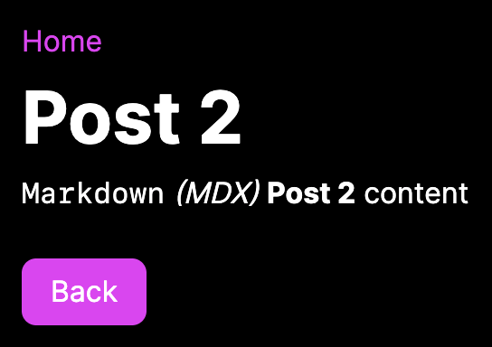

# Next.js Markdown Blog (App Router)

A Next.js markdown blog static site built with the App Router and MDX

> Note: To see a Live Demo, check out the [Next.js Markdown Blog (Pages Router)](https://github.com/emanuelefavero/next-markdown-blog) version and open the [Live Demo](https://next-markdown-blog-ivory.vercel.app/) link

#### Screenshot



## How to use

### Installation

- clone the repo and `cd` into it, then run:

```bash
npm install
```

### Development

- run the development server:

```bash
npm run dev
```

## How to create new posts

- create a new folder inside `app/(blog)/` with the name of your post
- create a new `page.mdx` file inside the folder

- add the Markdown content of your post in the `page.mdx` file

> TIP: MDX supports JSX, so you can also import and use React components in your MDX files

## Test Static Site Generation

- Make sure to add `output: 'export',` to the `next.config.mjs` file

```js
const nextConfig = {
  output: 'export',
}
```

- run the build command:

```bash
npm run build
```

- run the static site:

```bash
npx serve@latest out
```

## Resources

- [Next.js](https://nextjs.org/)
- [Next.js MDX](https://nextjs.org/docs/pages/building-your-application/configuring/mdx)
- [MDX](https://mdxjs.com/)
- [Static Web Page Wiki](https://en.wikipedia.org/wiki/Static_web_page?useskin=vector)
